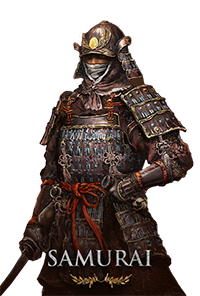

# Clases

Las clases en Elden Ring sirven como arquetipos iniciales que están disponibles para los jugadores. Todas las clases en Elden Ring siguen un concepto similar al visto en la saga Dark Souls, de forma que una clase determina el Equipamiento y Estadísticas iniciales, que más tarde podrán ser mejoradas a medida que se progresa en el juego. Esta página contiene una lista completa de las clases disponibles.

| Héroe     | Bandido      | Astrólogo      | Guerrero      |
|--------------|--------------|--------------|--------------|
|  |  |  |  |
| Prisionero     | Confesor     | Miserable      | Vagante      |
|  |  |  |  |
| Profeta      | Samurái    |              |              |
|  |  |              |              |
