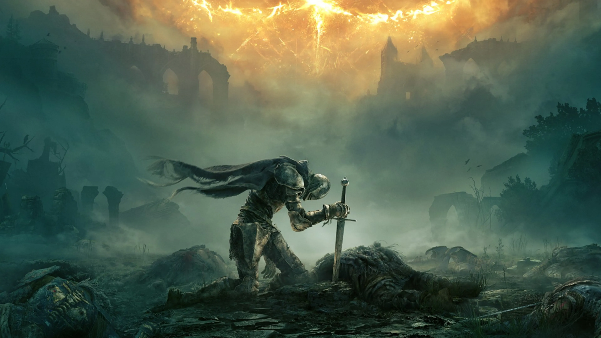

# Página sobre Elden ring

## Introducción

**Elden Ring** es un videojuego de rol en acción desarrollado por la empresa FromSoftware y publicado por Bandai Namco Entertainment. El videojuego surge de una colaboración entre el director y diseñador *Hidetaka Miyazaki* y el novelista de fantasía *George R. R. martin*

  

## ¿De qué trata?

**Elden Ring** es un videojuego de rol de acción en tercera persona, con una jugabilidad centrada en el combate y la exploración. Presenta características similares de otros juegos desarrollados por FromSoftware, tales como la saga Dark Souls, Bloodborne y Sekiro: Shadows Die Twice. Localizado en un mundo abierto, el jugador puede explorar libremente las Tierras Intermedias y sus seis áreas principales. Estas localizaciones varían desde Necrolimbo, una zona de prados verdes y ruinas antiguas, hasta Caelid, un páramo poblado de monstruos no-muertos.​ Las zonas de mundo abierto se pueden explorar con la montura espectral del personaje jugador, Torrentera, como principal método de viaje, además de la opción de viaje rápido fuera de combate. A lo largo del juego, el jugador puede encontrarse personajes no jugador (NPC) y enemigos, incluyendo semidioses que gobiernan cada área principal y sirven como los principales jefes del juego.​ Además de zonas de mundo abierto, el juego incluye también mazmorras escondidas, como catacumbas, túneles y cuevas donde los jugadores pueden pelear contra jefes y conseguir objetos valiosos.

El jugador elige una [clase de personaje](clases.md)  al inicio del juego, lo cual determina los hechizos y equipamiento con el que comienza la partida. El combate contra los enemigos puede ser a melé o a distancia usando armas a distancia o hechizos. Se puede bloquear los ataques de los enemigos mediante escudos o esquivando. Los hechizos permiten al jugador fortalecer sus armas, combatir a los enemigos a distancia o recuperar puntos de salud. En Elden Ring las armas se pueden mejorar utilizando las Cenizas de Guerra, objetos que añaden nuevas habilidades a las armas. Las Cenizas de Guerra se pueden aplicar o retirar en las armas, y cada Ceniza añade un Arte de Combate, una habilidad especial que puede ser utilizada en combate.​ Además del combate directo, las mecánicas de sigilo se pueden utilizar para evitar a los enemigos o acercarse a estos para realizar un ataque crítico escondido.

* [volver atras](README.md)
